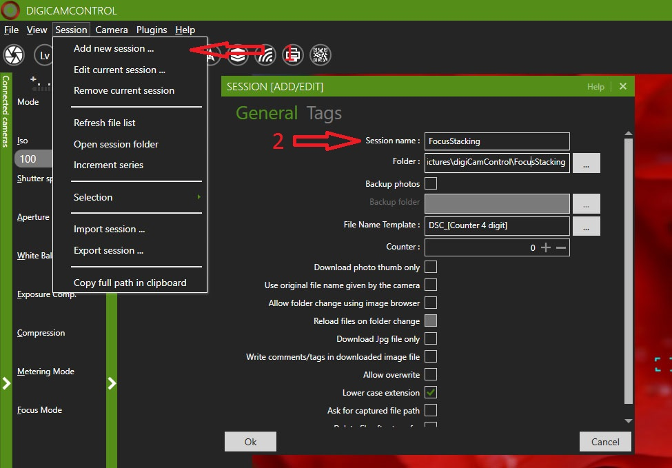
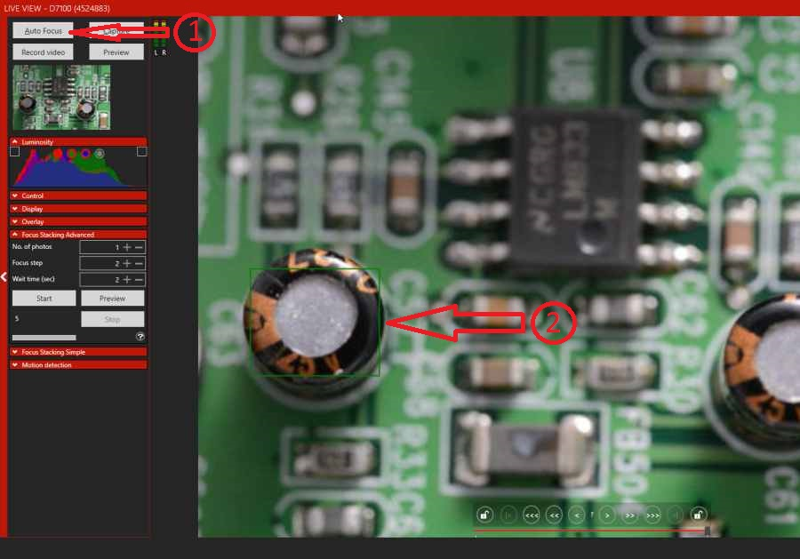
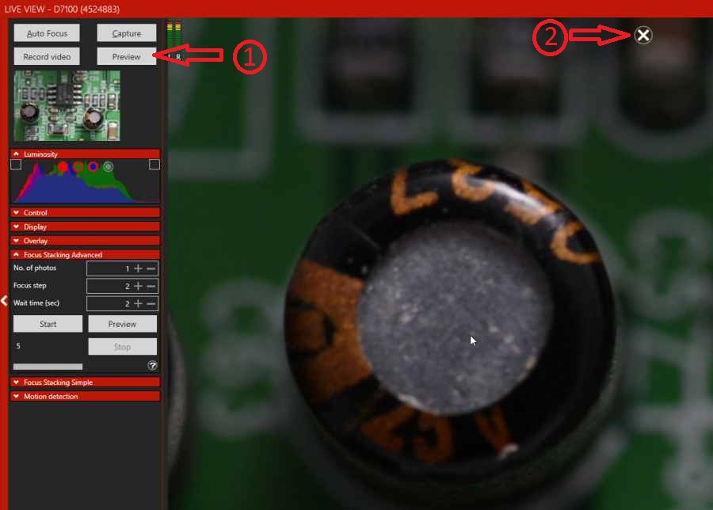
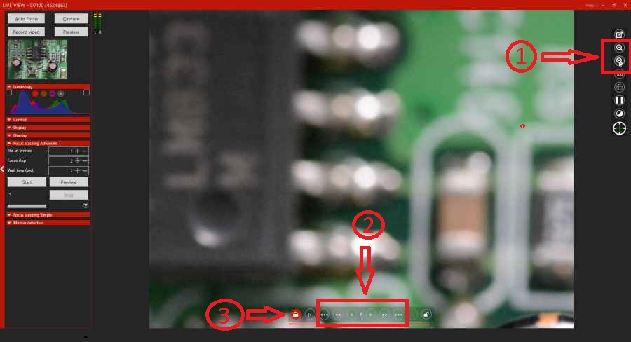
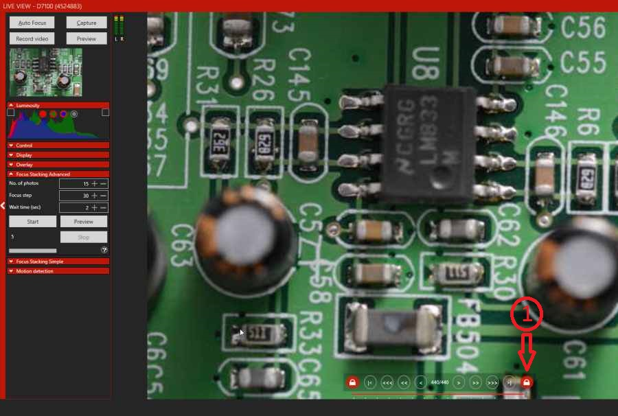
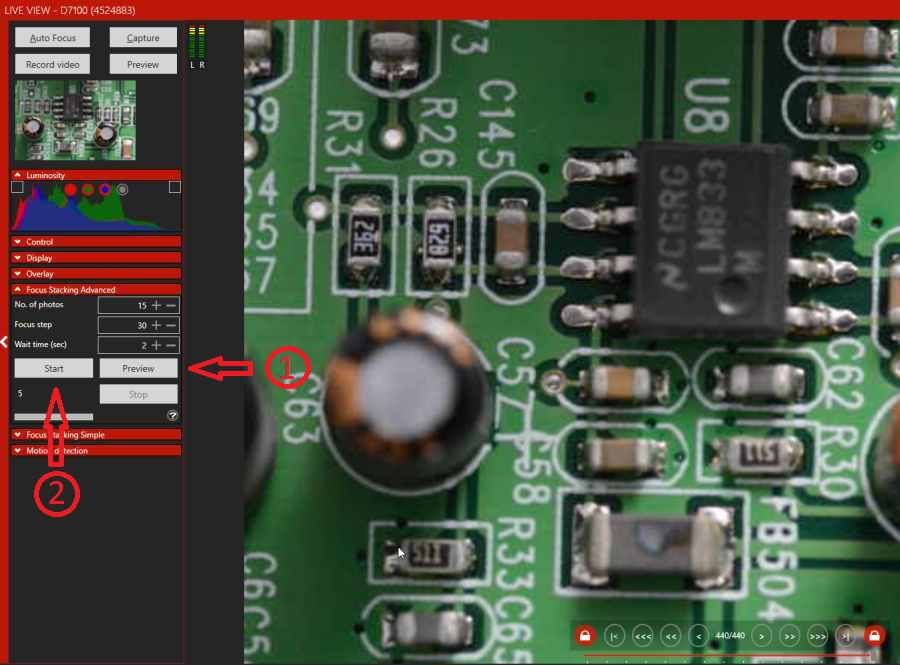
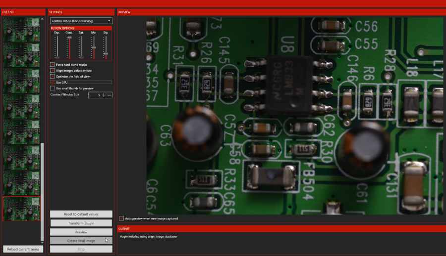

“Focus stacking  is a digital image processing technique which combines multiple images taken at different focus distances to give a resulting image with a greater depth of field(DOF) than any of the individual source images. Focus stacking can be used in any situation where individual images have a very shallow depth of field macro photography and optical microscopy are two typical examples”
digiCamControl (dCC) can help you to make series of photos with different focus, this technique works only  with static, not moving subjects and constant light condition.
This tutorial works with Nikon or Canon cameras with live view and dCC version 2.0.49 or higher. I did’t find any good example in my office, so i used an old tv tuner card. For the photos was used a D7100 and a Sigma 105mm f/2.8 EX DG OS HSM Macro Lens. The goal is to make a well focused full image, like this (no big deal just for example):

***Step 1***: After we start the application we need to start a new session (1) and add a name for it (2) and a folder name where the application saves the taken photos.

***Step 2****: Start live view, after moving the object in right position and using autofocus(1) to focus to the most closest focuspoint to camera (2).

***Step 3***: Using Preview (1) button we can inspect the captured image if the photo is well focused, this photo will not be saved in session file list or in pc hard disk. Using mouse wheel the image can be zoomed in and out for better focus checking. Also with preview we can check if the final image  is right exposed.  To return  to live view we need to close the preview image (2)

***Step 4***:  Fine tuning the distant focus point using live view zoom(1) and focus buttons (2) the preview button can be used any time to check the focus quality, after that locking that point using left side lock button (3), this operation prevent use to lose the closest focus point.

***Step 5***: Locking the distant focus point (1) using same method like in step 4.

***Step 6***: Using focus stacking preview button (1), we can check if all images will be focused well. The focus step value depends on lenses DOF, theoretically between 10-75, i use 30 for this images. If everything is right, using start button (2) to capture series of photos, this may take some time. If external flash is used then consider to rise the waiting time to have enough time for flash to recharge.

***Step 7***: If we done with capturing, we can preview the result with build in Enfuse plugin. (Menu=>Plugins=>Enfuse)

There are more possibilities free or paid  to combine this photos, take a look on [wiki](http://en.wikipedia.org/wiki/Focus_stacking). I personally i got the best result using photoshop, check this link for tutorial https://www.youtube.com/watch?v=gIh4v4RPQ70.  In the application are built in two plugins to help to combine focus stacked images, if you use and have installed in default location the CombineZ application you can use [CombineZp](http://www.hadleyweb.pwp.blueyonder.co.uk/) plugin or the Enfuse plugin. If you select one of the stacked images the plugins will load all files which were captured in same stack. 

<iframe width="560" height="315" src="https://www.youtube.com/embed/VGOHfDTLneg?rel=0&amp;controls=0&amp;showinfo=0" frameborder="0" allowfullscreen></iframe>
----